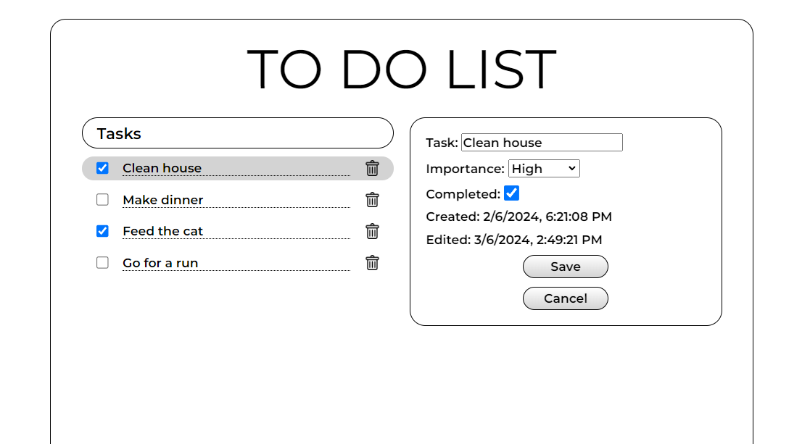

# Todo List

===========

## Snippets



## Description

This project is a to-do list web application with a backend built using Spring Boot and Java, and a frontend developed with Vite React using TypeScript. The application allows users to manage tasks by providing functionalities to add, edit, complete, and delete to-do tasks stored in a MySQL database.

### Tech Stack

    -   Spring Boot
    -   Java
    -   MySQL
    -   Vite React
    -   Typescript
    -   SCSS

## Documentation

    [Swagger API](http://localhost:8080/swagger-ui.html)

## Build Steps

### Backend

1.  Clone the repository.

```shell
git clone https://github.com/Abbby3/todo.git
```

2.  Navigate to the backend directory.

```shell
cd todo/backend/todo
```

3.  Copy the .env file and set the login info to your mysql database

```shell
cp .env.example .env
```

4.  Run the application.

```shell
mvn spring-boot:run
```

### Frontend

1.  Navigate to the frontend directory in a separate terminal.

```shell
cd todo/frontend/todo
```

2.  Install dependencies.

```shell
npm install
```

3.  Start the development server.

```shell
npm run dev
```

## Features

- Add, read, delete, and edit tasks.
- Toast notifications for error handling.
- Swagger documentation for API.
- Logging for request processing.

## Future Goals

- Integrate Mock Service Worker for testing api calls.

## Changelog

### 1.1.0

    -   Added testing with react-testing-library and vitest.
    -   UI redesign.
    -   Added toast notifications with react-toastify
    -   Added logging with Log4j.
    -   Integrated Swagger for API documentation.
